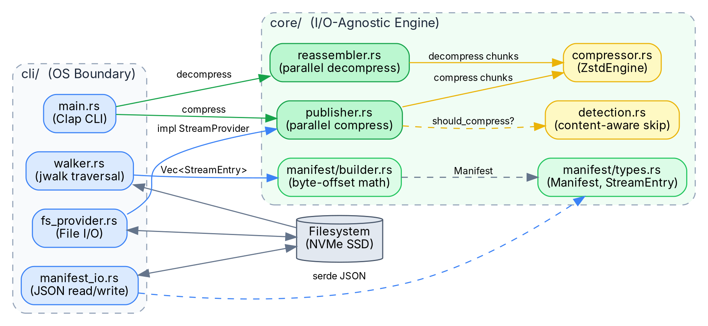
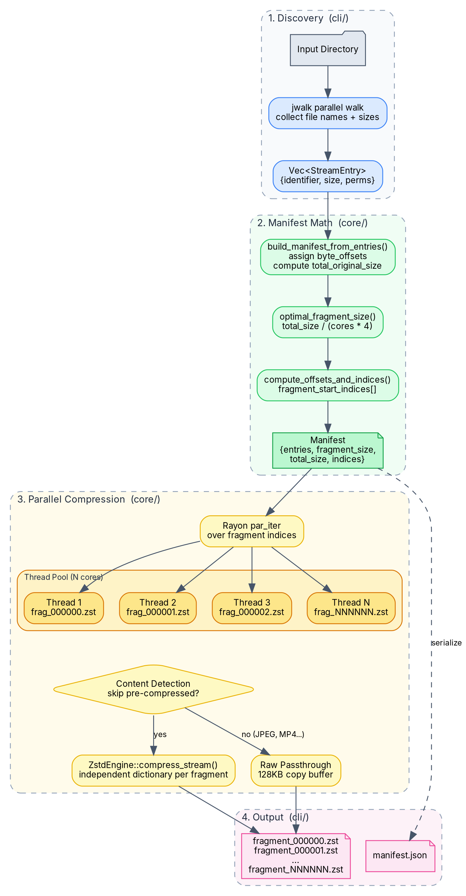
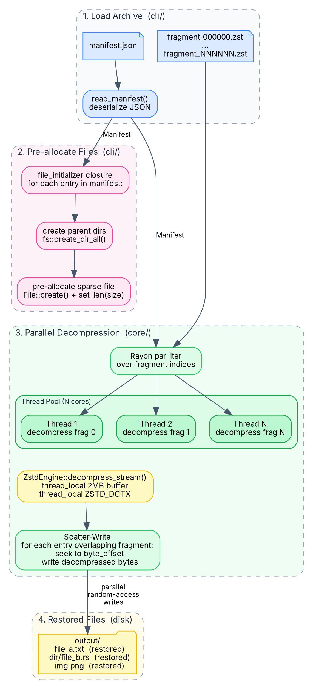
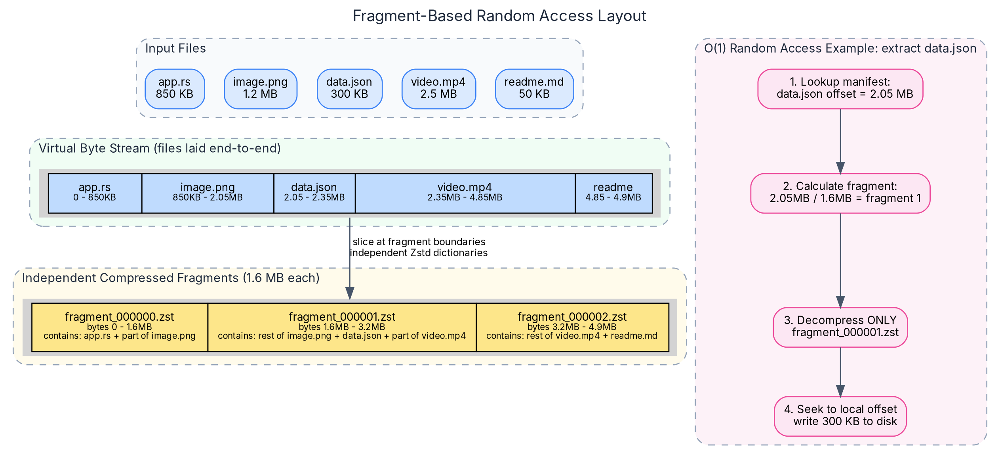
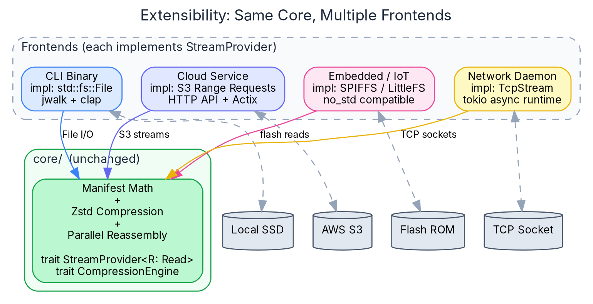

# Architecture

This document describes the internal architecture of the streaming compression engine, including the data flow, parallelism model, fragment-based random access design, and extensibility.

## System Overview

The project is structured as a Cargo workspace with a strict boundary between I/O and algorithms:

- **`core/`** — A pure algorithmic library with **zero filesystem imports**. It accepts Rust's `Read`/`Write` traits and data structures, never file paths. It can be embedded in any context (CLI, server, embedded).
- **`cli/`** — The native OS frontend. Handles directory walking (`jwalk`), manifest JSON persistence, and file I/O. It feeds data into the `core` engine via trait implementations.



The key insight is that `core/` never calls `std::fs` or `std::path`. All filesystem operations are injected by the caller through closures and trait objects. This is the [Hexagonal Architecture](https://en.wikipedia.org/wiki/Hexagonal_architecture_(software)) pattern (Ports and Adapters).

---

## Compression Pipeline

Compression proceeds in four stages:



### Stage 1: Discovery (cli/)

The CLI uses `jwalk` to perform a parallel directory walk, collecting file names, sizes, and permissions into a `Vec<StreamEntry>`. This is the only stage that touches the filesystem.

### Stage 2: Manifest Math (core/)

The core engine receives the raw entries and performs pure mathematical layout:

1. **`build_manifest_from_entries()`** — Sorts entries, assigns sequential `byte_offset` values (each file is placed end-to-end in a virtual byte stream), and computes `total_original_size`.
2. **`optimal_fragment_size()`** — Calculates the ideal fragment size using `total_size / (cores × 4)`, ensuring each CPU core gets at least 4 fragments to prevent thread starvation from work-stealing imbalance.
3. **`compute_offsets_and_indices()`** — Builds a `fragment_start_indices[]` array that maps each fragment index to the first file entry overlapping it. This enables O(1) lookups during compression and decompression without scanning all entries.

### Stage 3: Parallel Compression (core/)

The engine iterates over fragment indices using `Rayon::par_iter()`, distributing work across all CPU cores via work-stealing:

**Optimization: Asymmetric Thread Stragglers**  
Before parallelizing, the engine pre-calculates the "complexity" of each fragment (how many file boundaries overlap it). Fragments with many small files are CPU-heavy due to loop overhead and detection checks. The engine sorts fragments by complexity in descending order (longest-job-first). This ensures the heaviest fragments are picked up by Rayon threads immediately, preventing thread starvation where one thread is stuck processing a massive 50,000-file fragment at the very end while 19 other cores sit idle.

For each fragment, a thread:
1. Reads the relevant byte range from the virtual stream using a `FragmentReader` (which chains multiple file streams seamlessly across file boundaries).
2. Checks if the fragment contains only pre-compressed data (JPEG, MP4, ZIP, etc.) via `detection.rs`.
3. If compressible → compresses via `ZstdEngine::compress_stream()` with an independent dictionary.
4. If incompressible → copies raw bytes through a 128 KB passthrough buffer.

Each fragment gets its own independent Zstd dictionary, which is critical for enabling random-access decompression later.

### Stage 4: Output (cli/)

The CLI's `writer_factory` closure creates output files (`fragment_000000.zst`, etc.) and the manifest is serialized to `manifest.json`.

---

## Decompression Pipeline



Decompression also runs in parallel:

1. **Load** — The CLI reads `manifest.json` and deserializes it.
2. **Pre-allocate** — For each file in the manifest, the CLI creates parent directories and pre-allocates a sparse file using `File::create()` + `set_len(original_size)`. This avoids fragmented writes later.
3. **Parallel Decompress** — Rayon iterates over fragments in parallel. Each thread:
   - Decompresses the fragment using a `thread_local` 2 MB buffer and a pooled `ZSTD_DCTX` context.
   - For each file entry overlapping the fragment, seeks to the correct byte offset in the output file and writes the decompressed bytes directly (scatter-write pattern).
4. **Restore** — Files appear on disk with their original directory structure and permissions.

### Thread-Local Resource Pooling

To avoid allocator pressure in the hot loop, decompression uses `thread_local!` pools:

| Resource | Size per thread | Purpose |
|----------|----------------|---------|
| `DECOMPRESS_BUF` | 2 MB | Staging buffer for decompressed bytes |
| `ZSTD_DCTX` | ~128 KB | Reusable Zstandard decompression context |
| `COPY_BUF_POOL` | 128 KB | Raw copy buffer for passthrough fragments |

With 20 cores, this accounts for ~89 MB of fixed RAM — the deliberate tradeoff for parallel decompression.

---

## Fragment-Based Random Access

The core innovation that separates this engine from `tar + zstd` is **independent block-level compression**:



### Why tar cannot seek

In a traditional `tar.zst` archive, all files are concatenated into a single continuous Zstandard stream. The compression dictionary is built incrementally — each byte depends on the preceding bytes. To extract a file at offset 5 GB, you must decompress all 5 GB of preceding data to reconstruct the dictionary state.

### How we solve it

Our engine slices the virtual byte stream into fixed-size fragments (e.g., 500 MB). Each fragment is compressed **independently** with its own Zstd dictionary. This means:

- **O(1) file extraction:** To extract a specific file, look up its `byte_offset` in the manifest, divide by `fragment_size` to find the fragment index, decompress only that single fragment, and seek to the local offset.
- **Parallel decompression:** Since fragments are independent, they can be decompressed simultaneously on different CPU cores with no synchronization.
- **No ratio penalty:** Because fragments are large (hundreds of megabytes), Zstd has more than enough data within each block to build an effective dictionary. In benchmarks, our block-level compression achieves an identical ratio to solid `tar+zstd` (2.04x vs 2.03x on a 7.69 GB dataset).

---

## Content-Aware Compression Skipping

The `detection.rs` module identifies pre-compressed file formats to avoid wasting CPU cycles:

| Detection Method | Formats |
|-----------------|---------|
| **Magic bytes** (file header) | JPEG (`FF D8`), PNG (`89 50 4E 47`), MP4 (`ftyp`), Zstd (`28 B5 2F FD`) |
| **File extension** (fallback) | `.zip`, `.gz`, `.bz2`, `.xz`, `.7z`, `.rar`, `.mp4`, `.mkv`, `.webm`, `.jpg`, `.png`, `.webp`, `.mp3`, `.flac`, `.aac` |

When a fragment contains only incompressible files, the engine stores the raw bytes with a passthrough copy instead of invoking Zstd. This is disabled with `--no-skip`.

---

## Extensibility

Because the core engine operates purely on `Read`/`Write` traits, it can be consumed by any I/O frontend without modification:



To integrate a new data source, you implement two things:

1. **`StreamProvider<R: Read>`** — A trait that returns a readable stream for a given file identifier.
2. **`writer_factory` closure** — A function that creates a writable sink for each compressed fragment.

The manifest entries (`Vec<StreamEntry>`) can be constructed from any source — a database query, an API response, a network protocol — and fed directly into `build_manifest_from_entries()`.

---

## Key Data Structures

### `Manifest`
```rust
struct Manifest {
    entries: Vec<StreamEntry>,       // All files with byte offsets
    fragment_size: u64,              // Size of each fragment in bytes
    total_original_size: u64,        // Sum of all file sizes
    fragment_start_indices: Vec<usize>, // Maps fragment → first overlapping entry
    compression: CompressionAlgo,    // Zstd (currently the only algorithm)
    fragments: Vec<FragmentMeta>,    // Per-fragment metadata (compressed size, etc.)
}
```

### `StreamEntry`
```rust
struct StreamEntry {
    identifier: String,    // Relative path (e.g., "project/src/main.rs")
    original_size: u64,    // File size in bytes
    byte_offset: u64,      // Position in the virtual byte stream
    permissions: u32,      // Unix permission bits
    modified_at: u64,      // Modification timestamp
    symlink_target: Option<String>, // Symlink destination, if applicable
}
```

### `CompressionEngine` trait
```rust
trait CompressionEngine {
    fn compress_stream(&self, reader: &mut dyn Read, writer: &mut dyn Write) -> Result<()>;
    fn decompress_stream(&self, reader: &mut dyn Read, writer: &mut dyn Write) -> Result<()>;
}
```
