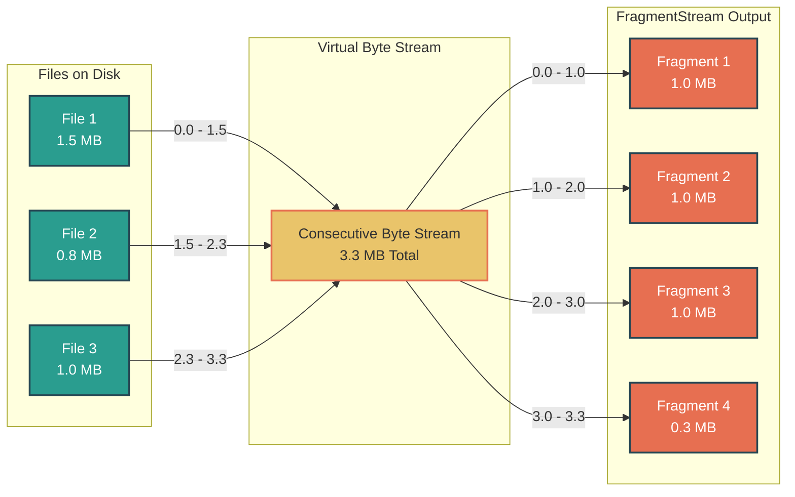
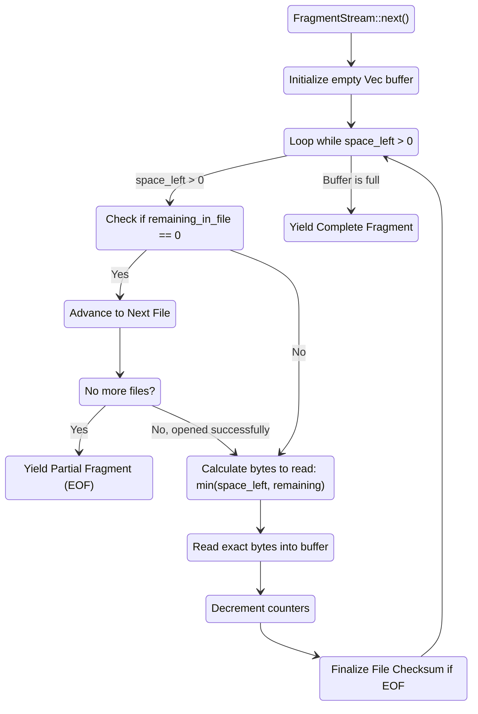

# Assembler Architecture

The `assembler.rs` module converts a scattered directory of files with varying sizes into a **contiguous, sequential stream of fixed-size data blocks** (fragments).

It dynamically spans across file boundaries, tracking offsets, boundaries, and checksums lazily so that everything runs with minimal memory overhead, processing chunks block-by-block.

## 1. Boundary-Spanning Data Flow

This diagram illustrates how files on disk map into a virtual infinitely contiguous byte stream, and how the `assembler.rs` iterator flawlessly slices that stream into fixed `fragment_size` targets (e.g. 1MB).

## 2. Iterator Internal Logic Map

How the `FragmentStream::next()` method determines how many bytes to read, handles reaching the end of individual files concurrently while building a single Fragment buffer.

